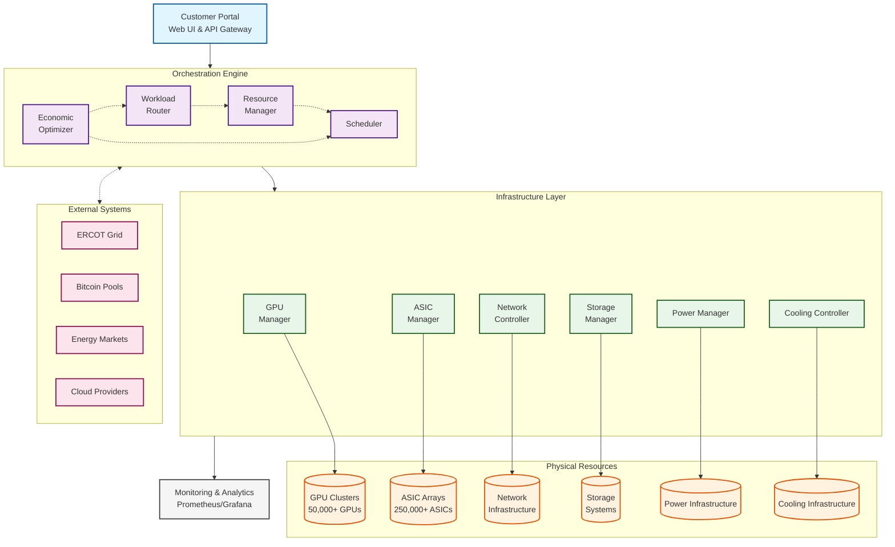

# Product Requirements Document - Software
## MARA Hybrid Compute Platform (HCP)

**Document Version**: 2.0
**Date**: October 2025
**Product Owner**: MARA Digital Infrastructure Division
**Target Launch**: Q2 2025 (MVP), Q4 2025 (Full Platform)

---

## 1. Executive Summary

The MARA Hybrid Compute Platform (HCP) is a cloud-native orchestration system that dynamically allocates computational resources between Bitcoin mining and AI inference workloads based on real-time economic signals. The platform will manage 50,000+ GPUs and 250,000+ ASICs across multiple global data centers, optimizing for revenue, energy efficiency, and grid stability.

**The Exaion acquisition significantly accelerates MARA's entry into the AI market.** Exaion brings existing AI infrastructure and expertise, including 1,250 operational GPUs across 4 data centers, partnerships with NVIDIA and Deloitte, and a GDPR-compliant, Tier-4 data center. This acquisition allows MARA to leverage existing AI infrastructure and expertise, reducing time-to-market and capital expenditure. The synergies between MARA's Bitcoin mining operations and Exaion's AI capabilities create a unique "digital energy infrastructure" company.

**Key Differentiators and Competitive Advantages:**

*   **First-mover advantage** in the converged AI-crypto infrastructure market.
*   **Capital efficiency and reduced time-to-market** resulting from the Exaion acquisition.
*   **Unique "digital energy infrastructure" narrative** for investors.

### Key Objectives

*   Enable sub-second workload switching between Bitcoin mining and AI inference
*   Maximize revenue through real-time economic optimization (Target: $750M-$1.5B additional annual revenue)
*   Provide enterprise-grade API for AI workload submission
*   Ensure 99.99% uptime for critical workloads
*   Achieve SOC 2 Type II and ISO 27001 compliance
*   Implement Edge Computing for local processing and rapid decision-making
*   Implement Dynamic Power Management for optimizing power consumption

---

## 2. System Architecture

### 2.1 Core Components



#### 2.1.1 Hardware Integration Layer

The hardware integration layer provides the software components that directly interface with the hardware, enabling dynamic resource switching. This layer includes:

*   **Power Management APIs**: APIs for controlling intelligent PDUs and automated transfer switches, enabling rapid switching between ASIC and GPU workloads.
*   **Cooling Control Interfaces**: Interfaces for optimizing thermal efficiency by controlling cooling systems based on workload and environmental conditions.
*   **Network Configuration Protocols**: Protocols for workload routing and isolation, ensuring secure and efficient data transfer.

### 2.2 Technology Stack

*   **Languages**: Go (core services), Python (ML/AI), TypeScript (frontend), Rust (system-level components), CUDA (GPU/CUDA programming)
*   **Infrastructure**: Kubernetes 1.28, Docker 24, Terraform 1.5
*   **Databases**: PostgreSQL 15 (operational), TimescaleDB (time-series), Redis 7.2 (cache), MongoDB (audit logs), Neo4j (resource relationships)
*   **Message Queue**: Apache Kafka 3.5, Celery with Redis (task queue)
*   **API Framework**: gRPC (internal), REST (external), OpenAPI 3.0 for APIs
*   **Monitoring**: Prometheus + Thanos, Elasticsearch + Fluentd, Jaeger, DataDog
*   **ML Framework**: TensorFlow, PyTorch (for optimization models)

---

## 3. Core Features

### 3.1 Economic Optimization Engine

**Purpose**: Maximize revenue by dynamically allocating resources based on real-time market conditions

**Requirements**:

| Feature | Description | Priority | Release |
|---------|-------------|----------|---------|
| Real-time Price Ingestion | Ingest electricity prices, GPU spot rates, BTC price | P0 | MVP |
| Profitability Calculator | Calculate ROI for each workload type per resource | P0 | MVP |
| Predictive Modeling | ML-based prediction of price movements (15-min horizon) | P1 | v1.0 |
| Multi-objective Optimization | Balance revenue, SLA, and grid requirements | P1 | v1.0 |
| Backtesting Framework | Test optimization strategies on historical data | P2 | v1.1 |

#### 3.1.1 Dynamic Resource Orchestration

The dynamic resource orchestration algorithms and models are used to allocate resources in real-time based on various factors. These include:

*   **Multi-objective Optimization Solver**: Used to balance revenue, SLA, and grid requirements. This solver takes into account factors such as market prices for Bitcoin mining and AI inference, energy prices and grid demand, workload priorities and SLA requirements, and hardware availability and performance.
*   **ML-based Price Prediction Models**: Used to forecast market conditions, including electricity prices, GPU spot rates, and BTC prices. These models use features such as time of day, day of week, electricity price, BTC price, network difficulty, GPU spot price, weather forecast, and grid demand.
*   **Risk-adjusted Returns Modeling and Portfolio Optimization**: Used to model risk-adjusted returns and optimize resource allocation strategies.

### 3.2 Workload Router

**Purpose**: Intelligently route and schedule workloads across distributed infrastructure

**Requirements**:

| Feature | Description | Priority | Release |
|---------|-------------|----------|---------|
| Workload Classification | Identify workload type and requirements | P0 | MVP |
| Intelligent Routing | Route based on latency, capacity, cost | P0 | MVP |
| Queue Management | Priority queues with fairness guarantees | P0 | MVP |
| Preemption Support | Pause/resume for priority workloads | P1 | v1.0 |
| Batch Optimization | Optimize batch job placement | P1 | v1.0 |
| Federation Support | Route across multiple regions | P2 | v1.1 |

**Workload Types**:

```yaml
workload_types:
  - type: ai_inference_realtime
    priority: 1
    max_latency_ms: 100
    interruptible: false
    
  - type: ai_inference_batch
    priority: 2
    max_latency_ms: 5000
    interruptible: true
    
  - type: bitcoin_mining
    priority: 3
    max_latency_ms: 60000
    interruptible: true
    
  - type: model_training
    priority: 2
    max_latency_ms: null
    interruptible: true
```

### 3.3 Resource Manager

**Purpose**: Manage and monitor all computational resources across facilities

**Requirements**:

| Feature | Description | Priority | Release |
|---------|-------------|----------|---------|
| Resource Discovery | Auto-discover GPUs, ASICs, CPUs | P0 | MVP |
| Health Monitoring | Real-time health and performance metrics | P0 | MVP |
| Capacity Planning | Predict and plan capacity needs | P1 | v1.0 |
| Fault Detection | ML-based anomaly detection | P1 | v1.0 |
| Auto-scaling | Dynamic resource scaling | P2 | v1.1 |

**Resource States**:

```json
{
  "resource_id": "gpu-cluster-tx-001",
  "type": "GPU_CLUSTER",
  "state": "ACTIVE",
  "capacity": {
    "total_gpus": 1000,
    "available_gpus": 750,
    "allocated_gpus": 250
  },
  "performance": {
    "utilization": 0.75,
    "temperature": 65,
    "power_consumption_kw": 375
  },
  "workload": "AI_INFERENCE"
}
```

### 3.4 Customer Portal & API

**Purpose**: Provide intuitive interface for customers to submit workloads and monitor usage

**Requirements**:

| Feature | Description | Priority | Release |
|---------|-------------|----------|---------|
| Web Dashboard | Real-time monitoring and control | P0 | MVP |
| REST API | Submit and manage workloads | P0 | MVP |
| SDKs | Python, Node.js, Java SDKs | P1 | v1.0 |
| CLI Tool | Command-line interface | P1 | v1.0 |
| Mobile App | iOS/Android monitoring apps | P2 | v1.2 |

**API Endpoints**:

```yaml
endpoints:
  - path: /v1/workloads/submit
    method: POST
    description: Submit new AI inference workload
    
  - path: /v1/workloads/{id}/status
    method: GET
    description: Get workload status and metrics
    
  - path: /v1/resources/availability
    method: GET
    description: Check resource availability
    
  - path: /v1/billing/usage
    method: GET
    description: Get usage and billing information
```

---

## 4. Infrastructure Services

### 4.1 Monitoring & Analytics

**Requirements**:

| Component | Metrics | Frequency | Storage |
|-----------|---------|-----------|---------|
| GPU Monitoring | Utilization, Memory, Temperature, Power | 1s | 30 days |
| ASIC Monitoring | Hash rate, Efficiency, Temperature | 10s | 30 days |
| Network Monitoring | Bandwidth, Latency, Packet Loss | 1s | 7 days |
| Application Metrics | Request rate, Latency, Errors | 1s | 90 days |

**Dashboards**:

*   Executive Dashboard (revenue, utilization, efficiency)
*   Operations Dashboard (health, alerts, capacity)
*   Customer Dashboard (usage, costs, SLA)
*   Energy Dashboard (consumption, PUE, heat recovery)

### 4.2 Billing & Metering

**Purpose**: Accurate usage tracking and flexible billing

**Billing Models**:

```python
billing_models = {
    "pay_per_use": {
        "gpu_hour": 2.50,
        "inference_request": 0.001,
        "storage_gb_month": 0.10
    },
    "reserved_capacity": {
        "gpu_month": 1200,
        "discount": 0.30
    },
    "spot_pricing": {
        "base_rate": 1.00,
        "multiplier": "dynamic"
    }
}
```

### 4.3 Security & Compliance

**Requirements**:

| Feature | Description | Priority | Compliance |
|---------|-------------|----------|------------|
| Data Encryption | AES-256 at rest, TLS 1.3 in transit | P0 | SOC 2 |
| Access Control | RBAC with MFA | P0 | ISO 27001 |
| Audit Logging | Immutable audit trail | P0 | SOC 2 |
| Network Isolation | VPC per customer | P0 | PCI DSS |
| Data Residency | Geographic constraints | P1 | GDPR |
| Key Management | HSM-based key storage | P1 | FIPS 140-2 |

#### 4.3.1 Security Measures

To protect the hybrid compute platform, the following security measures are implemented:

*   **Network Segmentation and Access Control Policies**: Used to isolate workloads and restrict access to sensitive resources.
*   **Data Encryption and Key Management Strategies**: Used to protect sensitive data at rest and in transit.
*   **Intrusion Detection and Prevention Systems**: Used to detect and respond to security threats in real-time.

### 4.4 Business Intelligence and Analytics Tools

To track performance and profitability, the following business intelligence and analytics tools are used:

*   **Prometheus and Grafana**: Used to monitor system performance and resource utilization in real-time.
*   **Data Warehousing and Reporting Tools**: Used to track revenue, costs, and profitability over time.
*   **Custom Dashboards and Reports**: Used to provide insights to stakeholders, including executives, operations staff, and customers.

### 4.5 Monitoring and Maintenance Tools

To ensure system reliability, the following monitoring and maintenance tools are used:

*   **Automated Monitoring and Alerting Systems**: Used to detect and respond to critical issues in real-time.
*   **Remote Management Capabilities**: Used for troubleshooting and maintenance, reducing the need for on-site support.
*   **Disaster Recovery and Business Continuity Plans**: Used to ensure system uptime in the event of a disaster.

---

## 5. Machine Learning Components

### 5.1 Demand Forecasting

**Model Requirements**:

```python
class DemandForecaster:
    """
    Predicts AI inference demand and Bitcoin mining profitability
    """
    features = [
        "time_of_day",
        "day_of_week", 
        "electricity_price",
        "btc_price",
        "network_difficulty",
        "gpu_spot_price",
        "weather_forecast",
        "grid_demand"
    ]
    
    models = {
        "short_term": "LSTM",  # 15-min to 1-hour
        "medium_term": "XGBoost",  # 1-hour to 24-hours
        "long_term": "Prophet"  # 1-day to 1-week
    }
```

### 5.2 Anomaly Detection

**Purpose**: Detect unusual patterns in workload, performance, or energy consumption

**Implementation**:

*   Isolation Forest for multivariate anomaly detection
*   LSTM Autoencoder for time-series anomalies
*   Statistical process control for threshold-based alerts

### 5.3 Predictive Maintenance

**Purpose**: Predict equipment failures and minimize downtime

**Implementation**:

*   Equipment failure prediction based on sensor data (temperature, vibration, power consumption)
*   Maintenance scheduling based on predicted failure rates

#### 5.3.1 Use of Machine Learning Models

*   **Demand Forecasting**: Used to allocate resources between Bitcoin mining and AI inference based on predicted demand and profitability.
*   **Anomaly Detection**: Used to identify and mitigate performance bottlenecks by detecting unusual patterns in workload, performance, or energy consumption.
*   **Predictive Maintenance**: Used to prevent equipment failures and minimize downtime by predicting equipment failure rates and scheduling maintenance proactively.

---

## 6. Integration Requirements

### 6.1 External Integrations

| System | Purpose | Protocol | Priority |
|--------|---------|----------|----------|
| ERCOT | Grid demand response | REST API | P0 |
| Electricity Markets | Real-time pricing | WebSocket | P0 |
| Bitcoin Pools | Mining pool integration | Stratum V2 | P0 |
| NVIDIA NGC | Container registry | REST | P0 |
| AWS/Azure/GCP | Hybrid cloud | SDK | P1 |
| Kubernetes | Container orchestration | API | P0 |
| OpenAI/Anthropic | Model serving | REST | P1 |

#### 6.1.1 Integration with External Systems

*   **ERCOT**: The hybrid compute platform integrates with ERCOT using REST APIs for grid demand response, allowing MARA to participate in demand response programs and contribute to grid stability.
*   **Electricity Markets**: Real-time pricing data is ingested from electricity markets using WebSockets, providing the platform with up-to-date information on energy prices.
*   **Bitcoin Pools**: The platform integrates with Bitcoin pools using the Stratum V2 protocol for mining operations, allowing MARA to efficiently allocate resources to Bitcoin mining.

### 6.2 Internal Systems

| System | Integration Type | Data Flow |
|--------|-----------------|-----------|
| Exaion Platform | API Gateway | Bidirectional |
| MARA Mining Ops | Message Queue | Unidirectional |
| Financial Systems | Database Sync | Batch ETL |
| HR Systems | LDAP/SSO | Authentication |

#### 6.2.1 Integration with Internal Systems

*   **Exaion Platform**: The hybrid compute platform integrates with Exaion's existing AI infrastructure through an API Gateway, enabling seamless workload migration and resource sharing.
*   **MARA Mining Ops**: Data flows unidirectionally from the hybrid compute platform to MARA's mining operations through a message queue, providing insights into resource utilization and performance.
*   **Financial Systems**: The platform integrates with financial systems for billing and revenue tracking through a database sync process using Batch ETL.

---

## 7. Performance Requirements

### 7.1 System Performance

| Metric | Requirement | Measurement |
|--------|-------------|-------------|
| API Latency (p50) | <50ms | Per endpoint |
| API Latency (p99) | <200ms | Per endpoint |
| Workload Switch Time | <100ms | GPU to ASIC |
| Throughput | 10,000 req/s | API Gateway |
| Availability | 99.99% | Monthly |
| Data Durability | 99.999999% | Annual |

### 7.2 Scalability

*   Support 100,000+ concurrent connections
*   Handle 1M+ workloads per day
*   Scale to 100,000+ GPUs
*   Process 1TB+ telemetry data per hour

---

## 8. Development Phases

### Phase 1: MVP (Q2 2025)

*   Core orchestration engine
*   Basic economic optimizer
*   GPU cluster management
*   REST API v1
*   Basic monitoring

### Phase 2: Production (Q3 2025)

*   Advanced ML optimization
*   Full Exaion integration
*   Enterprise features
*   Advanced monitoring
*   Compliance certifications

### Phase 3: Scale (Q4 2025)

*   Multi-region support
*   Advanced AI features
*   Partner integrations
*   Mobile applications
*   Marketplace features

---

## 9. Success Metrics

### Technical KPIs

*   Workload switch time: <100ms
*   Resource utilization: >95%
*   System uptime: >99.99%
*   API response time: <50ms (p50)

### Business KPIs

*   Revenue per GPU: >$5,000/month
*   Customer acquisition: 50+ enterprise clients
*   Churn rate: <5% monthly
*   NPS score: >50

---

## 10. Risk Mitigation

### Technical Risks

| Risk | Impact | Mitigation |
|------|--------|------------|
| Latency in switching | High | Pre-warm resources, predictive allocation |
| System complexity | High | Microservices architecture, gradual rollout |
| Data consistency | Medium | Event sourcing, CQRS pattern |
| Vendor lock-in | Medium | Open standards, abstraction layers |

### Security Risks

| Risk | Impact | Mitigation |
|------|--------|------------|
| DDoS attacks | High | CloudFlare, rate limiting |
| Data breaches | Critical | Encryption, access controls, auditing |
| Insider threats | High | Least privilege, monitoring |
| Supply chain | Medium | Vendor assessment, SBOMs |

---

## Appendix A: API Specification

### A.1 Workload Submission API

```json
POST /v1/workloads/submit
{
  "workload_type": "ai_inference",
  "model_id": "llama-70b",
  "priority": 1,
  "requirements": {
    "gpu_type": "H100",
    "gpu_count": 8,
    "memory_gb": 640,
    "max_latency_ms": 100
  },
  "input_data": {
    "type": "text",
    "size_mb": 10
  },
  "callback_url": "https://customer.com/callback"
}
```

Response:

```json
{
  "workload_id": "wl-123456",
  "status": "queued",
  "estimated_start": "2025-03-01T10:00:00Z",
  "estimated_cost": 25.50,
  "sla": {
    "guaranteed_latency_ms": 100,
    "availability": 0.9999
  }
}
```

### A.2 Resource Query API

```json
GET /v1/resources/availability?region=us-central&gpu_type=H100&count=10
```

Response:

```json
{
  "available": true,
  "resources": [
    {
      "region": "us-central",
      "facility": "texas-1",
      "gpu_type": "H100",
      "available_count": 50,
      "price_per_hour": 2.50,
      "carbon_intensity": 0.35
    }
  ]
}
```

---

## Appendix B: Database Schema

### B.1 Core Tables

```sql
-- Workloads table
CREATE TABLE workloads (
    id UUID PRIMARY KEY,
    customer_id UUID NOT NULL,
    type VARCHAR(50) NOT NULL,
    status VARCHAR(20) NOT NULL,
    priority INTEGER NOT NULL,
    requirements JSONB,
    created_at TIMESTAMP NOT NULL,
    started_at TIMESTAMP,
    completed_at TIMESTAMP,
    cost DECIMAL(10,2),
    FOREIGN KEY (customer_id) REFERENCES customers(id)
);

-- Resources table
CREATE TABLE resources (
    id UUID PRIMARY KEY,
    facility_id UUID NOT NULL,
    type VARCHAR(20) NOT NULL,
    subtype VARCHAR(50),
    status VARCHAR(20) NOT NULL,
    capacity JSONB,
    metadata JSONB,
    created_at TIMESTAMP NOT NULL,
    updated_at TIMESTAMP NOT NULL,
    FOREIGN KEY (facility_id) REFERENCES facilities(id)
);

-- Allocations table
CREATE TABLE allocations (
    id UUID PRIMARY KEY,
    workload_id UUID NOT NULL,
    resource_id UUID NOT NULL,
    allocated_at TIMESTAMP NOT NULL,
    released_at TIMESTAMP,
    utilization JSONB,
    FOREIGN KEY (workload_id) REFERENCES workloads(id),
    FOREIGN KEY (resource_id) REFERENCES resources(id)
);
```

---

## Document Control

| Version | Date | Author | Changes |
|---------|------|--------|---------|
| 2.0 | Oct 2025 | MARA Tech Team | Refined version |

**Next Review Date**: January 2026
**Approval Required From**: CPO, CTO, VP Engineering, VP Product, Security Headd